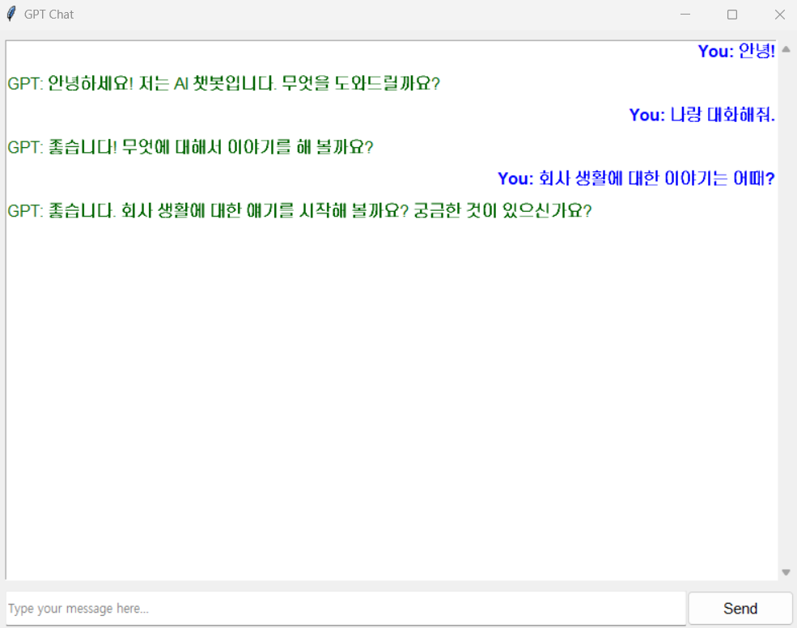

# My Custom ChatGPT

chatgpt를 활용한간단한 챗봇 구현

## Usages

### 1. 환경 변수 설정

Windows에서 시스템 환경 변수를 설정하는 방법은 다음과 같습니다.

1. 제어판 > 시스템 및 보안 > 시스템 > 고급 시스템 설정 > 환경 변수로 이동합니다.
2. "시스템 변수" 섹션에서 "새로 만들기" 버튼을 클릭합니다.
3. 변수 이름에 `OPENAI_API_KEY`를 입력하고, 변수 값에 API 키를 입력한 다음 "확인" 버튼을 클릭하여 저장합니다.
4. 모든 창을 닫고 시스템에 변경 사항이 적용되도록 명령 프롬프트 또는 PowerShell을 재시작합니다.

### 2. Config 설정

`config.py` 파일에서 원하는 값을 설정합니다.
~~~
save_messages : 대화내용을 저장할지 여부 
dir_save : 대화내용을 저장할 폴더명
~~~

## 3. 실행 방법

프로젝트를 실행하려면 다음 명령어를 사용합니다.
~~~
# cmd에서 대화하기
python chatboy.py

# 채팅창에서 대화하기
python app.py
~~~
